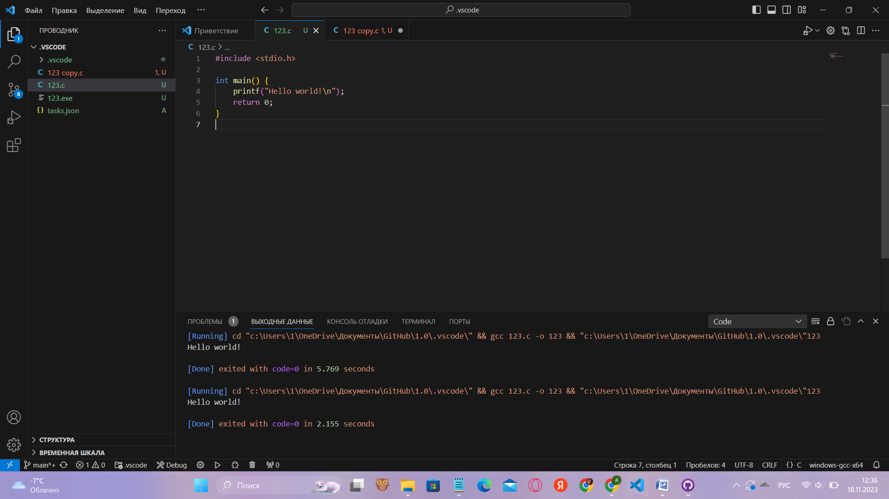

"# 1.0"  
# Лабораторная работа №0.
 ## Изучение компилятора gcc и его опций. 

### 1. Регистрация на GitHub.

Зарегистрировались на сайте [GitHub](https://github.com/)

### 2. Программа *Hello world!*.

Написали программу на языке программирования С:

    int main(void)
    { printf("Hello world!\n");
      return 0;
    }

### 3. Сохранили программу *ctrl + s*.

### 4. Компиляция.

С помощью ключа `gcc name.c` скомпилировали программу, получив файл a.out.

Введение ключа `./a.out` происходит запуск программы.

Ключ `gcc name.c -o name` задаёт имя исполняемого файла.

Ключ `gcc name.c -E -o name.i` прервёт и даст просмотреть содержимое файла, обработанного препроцессором.

`gcc name.c -S` остановит процесс создания исполняемого файла по завершении компиляции, появился файл name.s, содержащий реализацию программы на языке ассемблера.

`gcc name.c -c` трансляция кода на языке ассемблера в машинный код, по итогу чего появляется файл с именем name.o

`gcc name.c -g` помещает в объектный или исполняемый файл информацию необходимую для работы отладчика gdb.

### 5. Скриншоты результатов.

## Список используемых источников:

1. [Markdown Cheat Sheet](https://www.markdownguide.org/cheat-sheet/)
2. [Пример отчёта](https://github.com/still-coding/report_demo)