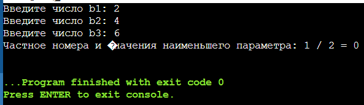

# Лабораторная работа №1.
 ## Ветвящиеся алгоритмы. 


### 1. Разберите код программы из примера.
```c   
    #include <stdio.h>
    #include <math.h>

    int main()
    {
    // Объявление переменных
    float a, b, c;
    
    // Ввод коэффициентов от пользователя
    printf("Enter a -> ");
    scanf("%f", &a);
    printf("Enter b -> ");
    scanf("%f", &b);
    printf("Enter c -> ");
    scanf("%f", &c);

    // Проверка, что все коэффициенты равны нулю
    if (!a && !b && !c)
        return 0;

    // Вывод функции в формате a * x^2 + b * x + c на экран
    float x = 1.0f;
    printf("f(x) = ");
    if (a)
    {
        printf("%f * x^2 ", a);
        if (b > 0.0f)
            printf("+ ");
    }
    if (b)
        printf("%f * x ", b);
    if (c)
    {
        if (c > 0.0f)
            if (a || b)
                printf("+ ");
            else
                printf("- ");
        printf("%f", fabs(c));
    }
    printf("\n");

    // Вычисление значения функции в точках x и -x
    float f_x = a * x * x + b * x + c;
    float f_minus_x = a * -x * -x + b * -x + c;

    // Проверка функции на четность или нечетность
    if (f_x == f_minus_x)
        printf("Function is even: f(x) = %f = f(-x) = %f\n", f_x, f_minus_x);
    else if (f_minus_x == -f_x)
        printf("Function is odd: f(-x) = %f = -f(x) = %f\n", f_minus_x, -f_x);
    else
        printf("Function is neither even nor odd: f(x) = %f != f(-x) = % f != -f(x) = %f\n", f_x, f_minus_x, -f_x);

    // Поиск вершины функции и определение ее типа
    if (a)
    {
        float vx = -b / (2.0f * a);
        float vy = a * vx * vx + b * vx + c;
        printf("Vertex (%f, %f) is a ", vx, vy);
        if (a > 0.0f)
            printf("minimum");
        else
            printf("maximum");
        printf("\n");
    }

    return 0;
    }
```    

### 2. Программа, решающая задачу.
 Вывести номер наименьшего параметра b1, b2, b3, в случае, если его значение нечётно, и частное номера и значения этого параметра иначе. Количество цифр после запятой равно номеру параметра.
 Сделайте свою программу выполняющейся до тех пор, пока пользователь не введёт все нулевые значения.
 Реализуйте сохранение вывода программы и пользовательского ввода в лог-файл.
 Реализуйте “защиту от дурака” – обработайте пользовательский ввод таким образом, чтобы выполнение алгоритма программы невозможно было нарушить некорректным пользовательским вводом.

```c
    #include <stdio.h>

int main() {
    // Объявление переменных
    int b1, b2, b3;
    int minVal, minPos;

    // Ввод значений
    printf("Введите число b1: ");
    scanf("%d", &b1);
    printf("Введите число b2: ");
    scanf("%d", &b2);
    printf("Введите число b3: ");
    scanf("%d", &b3);

    // Нахождение наименьшего значения и его позиции
    minVal = b1;
    minPos = 1;

    if (b2 < minVal) {
        minVal = b2;
        minPos = 2;
    }

    if (b3 < minVal) {
        minVal = b3;
        minPos = 3;
    }

    // Проверка на четность или нечетность наименьшего значения
    if (minVal % 2 == 0) {
        // Наименьшее число четное
        printf("Частное номера и значения наименьшего параметра: %d / %d = %d\n", minPos, minVal, minPos / minVal);
    } else {
        // Наименьшее число нечетное
        printf("Номер наименьшего параметра: %d\n", minPos);
    }

    return 0;
}

```

### 2. Блок-схема.


### 3. Скриншоты результатов.



