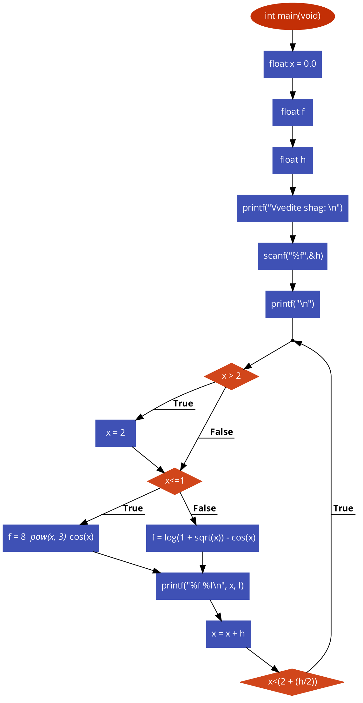
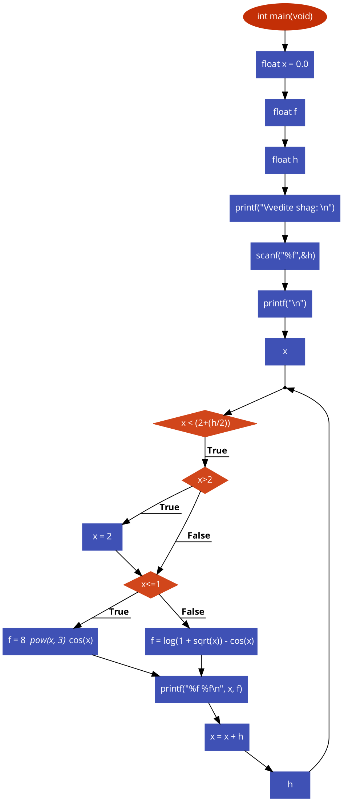
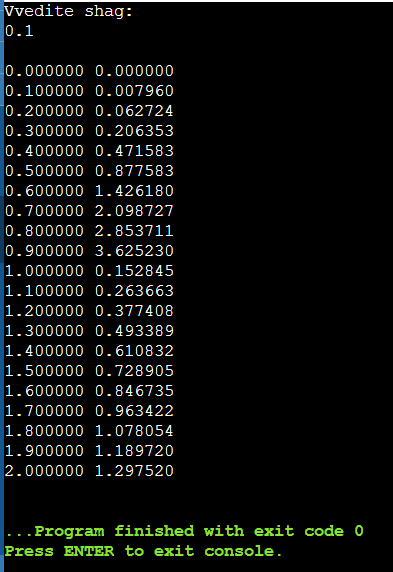

#  Лабораторная работа №2.
## Циклические алгоритмы.
### Задание.
Вывести таблицу значений и построить график функции с заданным шагом.


### Программа с использованием цикла `do while`.
 ```c
#include <stdio.h>
#include <math.h>
#include <stdlib.h>
#include <unistd.h>


int main(void)
{
   float x = 0.0;
   float f;
   float h;
   printf("Vvedite shag: \n");
   scanf("%f",&h);

   printf("\n");
   do {
       if (x > 2)
           x = 2;
       if (x<=1)
       f = 8 * pow(x, 3) * cos(x);
   else
       f = log(1 + sqrt(x)) - cos(x);
   printf("%f %f\n", x, f);
   x = x + h;
   } while (x<(2 + (h/2)));
}
 ```
### Программа с использованием цикла `for`.
 ```c
#include <stdio.h>
#include <math.h>
#include <stdlib.h>
#include <unistd.h>


int main(void)
{
   float x = 0.0;
   float f;
   float h;
   printf("Vvedite shag: \n");
   scanf("%f",&h);

   printf("\n");
for(x;x < (2+(h/2)); h)
   {
       if (x>2)
           x = 2;
       if (x<=1)
       f = 8 * pow(x, 3) * cos(x);
   else 
       f = log(1 + sqrt(x)) - cos(x);
   printf("%f %f\n", x, f);
   x = x + h;
   }
}
}
 ```
 ### Как запустить код чтобы выводил график.
 1. Компилируем код `gcc lb2.c`(если выдаёт ошибку, то пишем `gcc lb2.c -lm`)
 2. Запускаем код для проверки `./a.out` или `./a.exe` если ос Windows.
 3. Переносим вывод кода в файл `./a.out > my_graph.txt`.
 4. Выполняем команду `chmod +x plot.gpi`.
 5. Вводим команду `./plot.gpi` и получаем график.
### Результаты программы и схемы.
#### do while

Блок-схема


#### for

Блок-схема



Результат

