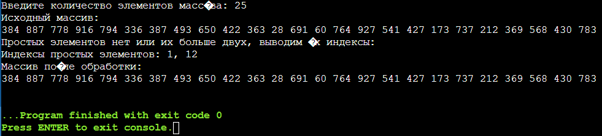

# Лабораторная работа №1.
 ## Массивы и функции.


### 1. Программа,решающая задачу.
Найти простые элементы массива натуральных чисел. Вывести на экран, если такой элемент один, поменять местами, если их два, иначе - вывести их индексы.
```c
#include <stdio.h>
#include <stdlib.h>

// Функция для проверки, является ли число простым
int isPrime(int num) {
    if (num <= 1) {
        return 0;
    }

    for (int i = 2; i < num; i++) {
        if (num % i == 0) {
            return 0;
        }
    }

    return 1;
}

// Функция для поиска простых элементов массива и их обработки
void processArray(int* arr, int size) {
    int firstIndex = -1;
    int secondIndex = -1;
    int primeCount = 0;

    // Поиск простых элементов и их индексов
    for (int i = 0; i < size; i++) {
        if (isPrime(arr[i])) {
            primeCount++;
            if (firstIndex == -1) {
                firstIndex = i;
            } else if (secondIndex == -1) {
                secondIndex = i;
            }
        }
    }

    // Обработка найденных простых элементов
    if (primeCount == 1) {
        printf("Простой элемент один, меняем местами:\n");
        int temp = arr[firstIndex];
        arr[firstIndex] = arr[size - 1];
        arr[size - 1] = temp;
    } else if (primeCount == 2) {
        printf("Простых элементов два, меняем их местами:\n");
        int temp = arr[firstIndex];
        arr[firstIndex] = arr[secondIndex];
        arr[secondIndex] = temp;
    } else {
        printf("Простых элементов нет или их больше двух, выводим их индексы:\n");
        printf("Индексы простых элементов: %d, %d\n", firstIndex, secondIndex);
    }

    // Вывод массива после обработки
    printf("Массив после обработки:\n");
    for (int i = 0; i < size; i++) {
        printf("%d ", arr[i]);
    }
    printf("\n");
}

int main() {
    int size;

    printf("Введите количество элементов массива: ");
    scanf("%d", &size);

    int* arr = (int*)malloc(size * sizeof(int));

    // Заполнение массива случайными числами
    for (int i = 0; i < size; i++) {
        arr[i] = rand() % 1000 + 1; // Сгенерировать случайное число от 1 до 1000
    }

    // Вывод исходного массива
    printf("Исходный массив:\n");
    for (int i = 0; i < size; i++) {
        printf("%d ", arr[i]);
    }
    printf("\n");

    // Обработка массива
    processArray(arr, size);

    free(arr);
    return 0;
}
```

### 2. Скриншоты результатов.
